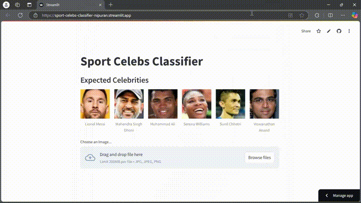

# Sport Celebs Classifier

## Project Overview

This project aims to classify images of sports celebrities, allowing users to identify famous personalities based on uploaded images. The app leverages a machine learning pipeline with an SVM model, incorporating wavelet transformation for effective image preprocessing and enhanced classification accuracy.

## Table of Contents

- [Installation Guide](#installation-guide)
- [Usage](#usage)
- [Dataset](#dataset)
- [Model Information](#model-information)
- [Results](#results)
- [Streamlit App](#streamlit-app)

## Installation Guide

### 1. Clone the repository:
   ```bash
   git clone https://github.com/nipuran/sport-celebs-classifier.git
   ```

### 2. Navigate to the project directory:
   ```bash
   cd sport-celebs-classifier
   ```

### 3. Create a virtual environment:
   ```bash
   python -m virtualenv .venv
   ```

### 4. Activate the virtual environment:
   On **Windows**:
   ```bash
   .venv\Scripts\activate
   ```
   On **macOS/Linux**:
   ```bash
   source .venv/bin/activate
   ```

### 5. Install dependencies:
   ```bash
   pip install -r requirements.txt
   ```

   > **Note:** The `requirements.txt` file includes the following packages:

   - [NumPy](https://pypi.org/project/numpy/) - For numerical computations.
   - [Pandas](https://pypi.org/project/pandas/) - For data manipulation.
   - [Matplotlib](https://pypi.org/project/matplotlib/) - For data visualization.
   - [OpenCV](https://pypi.org/project/opencv-python/) - For image processing.
   - [Seaborn](https://pypi.org/project/seaborn/) - For enhanced data visualization.
   - [PyWavelets](https://pypi.org/project/PyWavelets/) - For wavelet transformations.
   - [scikit-learn](https://pypi.org/project/scikit-learn/) - For building machine learning models.
   - [Pillow](https://pypi.org/project/Pillow/) - For image handling and manipulation.
   - [Streamlit](https://pypi.org/project/streamlit/) - For deploying the web app.

## Usage

1. Open the Jupyter Notebook to explore the dataset and model:
   ```bash
   jupyter notebook
   ```

2. Run the script to run the Streamlit app using the terminal:
   ```bash
   streamlit run app.py
   ```

## Dataset

The dataset was manually created using the **Fatkun Batch Download Image** browser extension to extract images of sports celebrities, providing labeled data for training the classification model.


## Model Information

The following models are experimented with to classify sports celebrity images:

- **Logistic Regression**: A binary classification algorithm that models the probability of a class label based on a linear combination of input features, ideal for scenarios with two classes.

- **Support Vector Machine (SVM)**: A powerful classification technique that finds the optimal hyperplane to separate different classes in the feature space, effective in high-dimensional spaces and with clear margin separation.

- **Random Forest**: An ensemble learning method that constructs multiple decision trees during training and outputs the mode of their predictions, providing robustness and improved accuracy by reducing overfitting.

## Techniques

- **Image Cropping**: Utilized OpenCV with Haar Cascade face and eye detection to crop the images. The Haar Cascade files were sourced from [OpenCV Haar Cascades](https://github.com/opencv/opencv/tree/4.x/data/haarcascades).
  
- **Image Transformation**: Applied wavelet transformation to the cropped images, combining the original and transformed images vertically to create a comprehensive set of independent variables.

- **Model Training**: Employed techniques such as train-test split, cross-validation, and hyperparameter tuning to optimize model performance and identify the best model.

- **Model Persistence**: Saved the final model into a pickle file for easy retrieval and deployment in future applications.

The models have been fine-tuned using cross-validation, and the best model parameters are presented in the results section.


## Results

| Model               | Best Score | Best Parameters                               |
|---------------------|------------|----------------------------------------------|
| Support Vector Machine | 0.786216  | {'svc__C': 1, 'svc__kernel': 'linear'}     |
| Random Forest       | 0.572710   | {'randomforestclassifier__n_estimators': 10} |
| Logistic Regression  | 0.833580   | {'logisticregression__C': 1}                |

## Streamlit App

[Streamlit app](https://sport-celebs-classifier-nipuran.streamlit.app/) is deployed to showcase the model's predictions interactively.

### Preview


